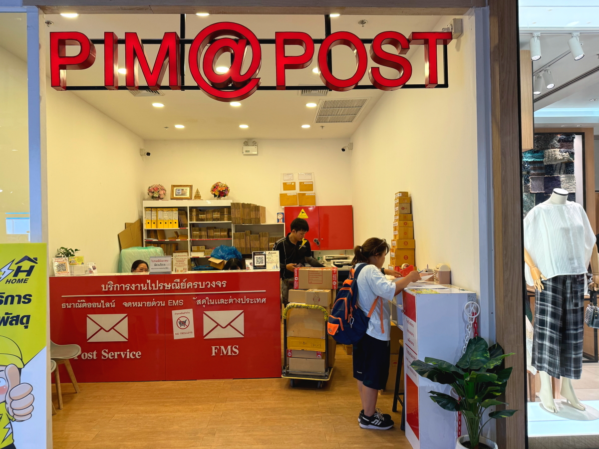
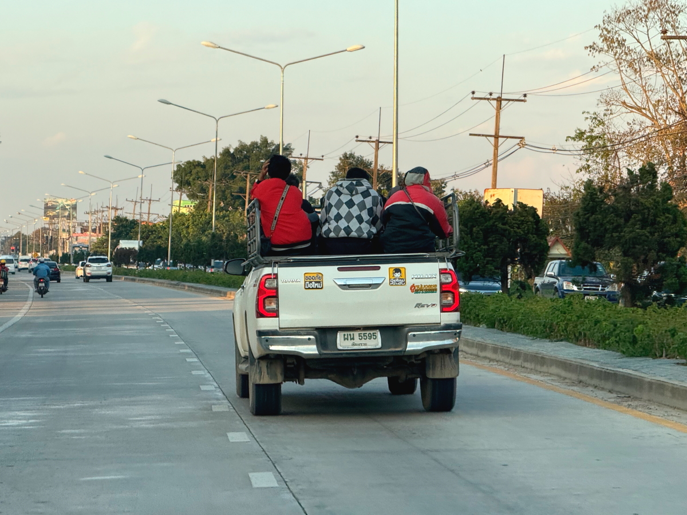

# 20241204_chiangrai

<html>
<head>

<meta charset="UTF-8">
<meta http-equiv="Content-Type" content="text/html; charset=UTF-8">
<meta http-equiv="X-UA-Compatible" content="IE=EmulateIE10" />
<meta http-equiv="X-UA-Compatible" content="IE=edge">

<!--ここから上はお決まりの定型文です-->

<!--ここからが表現の書式などを決めるcssという部分-->

<link href="https://cdnjs.cloudflare.com/ajax/libs/lightbox2/2.7.1/css/lightbox.css" rel="stylesheet">

</head>

<body>

モバイル端末をお使いの場合は、画面を横向きにすると
より見やすくご覧頂けます。

<!--ここ上は、ほぼそのまま使います！-->

<!--QRコードの挿入例-->

 アクセス用QRコード

<marquee direction="left" scrollamount="20" width="30%">(^_^)/~S,Hada</marquee>

<!--流れ文字の挿入例-->
<h1><marquee behavior="left">!!! 2024/12/03〜12/04 、チェンライで過ごす日々をまとめました !!!</marquee></h1>

                          

<!--ここから下が、本体部分-->

<h2>12月3日、朝は義妹のお店で朝食</h2>

<h2>お店の裏、山の上にはワンちゃん雲たちがみんなで左向き！</h2>

<h2>コーヒー店では、スマホのキャリア契約(AIS)していると無料サービス</h2>

<h2>この日も仏壇の向こうに夕陽が暮れていきました</h2>

  

<h2>12月4日、朝から国道を南下してショッピングモール「CENTRAL」向かいます 沿道のお花が咲き誇ってました</h2>

<h2>店内はクリスマスムード</h2>

<h2>Hondaの２輪展示販売では「Monkey」がイチオシに！</h2>

<h2>ぬいぐるみ系の盛り上がり方は凄そうです</h2>

<h2>クリスマスムードの４輪ディーラー</h2>

<h2>コンパニオンのお姉様たちは、空いた時間で自撮り合戦</h2>

<h2>女性陣はサンタさんに皆注目</h2>

<h2>若い男性陣は、最新スマホが気になる感じ</h2>

<!--
-->

<h2>滞在期間が２週間超えたので、現地での定住場所を登録してパスポートに記載する手付きをします</h2>

<h2>モール内にある郵便局で必要書類をコピーします</h2>

<h2>比較的スムースに手続きが終了してパスポートにメーチャンでの居住地が記載されました</h2>

<h2>公的機関（役所か軍関連？）のお兄さんは長袖長ズボンでヘルメット着用してます 走りはダイナミックでした</h2>

<h2>ほとんどのスクーターはこんな感じで乗ります</h2>

<iframe width="560" height="315" src="https://www.youtube.com/embed/OYxw8ieg80w?si=JfqH6L-UfOxLAlQ9" title="YouTube video player" frameborder="0" allow="accelerometer; autoplay; clipboard-write; encrypted-media; gyroscope; picture-in-picture; web-share" referrerpolicy="strict-origin-when-cross-origin" allowfullscreen></iframe> 

<iframe width="560" height="315" src="https://www.youtube.com/embed/A3bZbzw_Cc4?si=Fg03XB-eWwgK-a6x" title="YouTube video player" frameborder="0" allow="accelerometer; autoplay; clipboard-write; encrypted-media; gyroscope; picture-in-picture; web-share" referrerpolicy="strict-origin-when-cross-origin" allowfullscreen></iframe> 

<h2>白人のご夫婦はタクシーからスマホで撮影</h2>

<h2>古いピックアップトラックは、タイヤをはみ出させるのが主流っぽいですね〜これ合法です</h2>

<h2>夕方の帰宅時間なので、荷台は人でいっぱい</h2>

<h2>7/11の敷地内にあるラーメン屋さんで夕食</h2>

<h2>一杯50バーツ</h2>

<h2>支払い方法はスマホ決済、日本のPayPayと同じくらいの普及率らしいです</h2>

<h2>味付けは好みに合わせて、自己責任で・・・間違うと大変なことに！</h2>

<h2>トイレは？と聞くと7/11の建物の後ろ側の空き地・・・男性専用です</h2>

<h2>お空には細いお月さま</h2>

<h2>夕暮れには、金星と三日月のコラボが見事でした（日本でもこうなってますね）</h2>

<h2>熱帯のお花たちは綺麗ですね〜</h2>

  

  

   

   

         

  

      

<!--本体はここまで-->

<!--画面に空白地帯を作って、背景が見えるようにしています-->
                                              

<!-- フッタ -->
<footer>

Copyright 2024/12/05 S,Hada @ChiangRai

</footer>

<!--HPにさまざまなJavaScriptを呼び込むための書式-->

